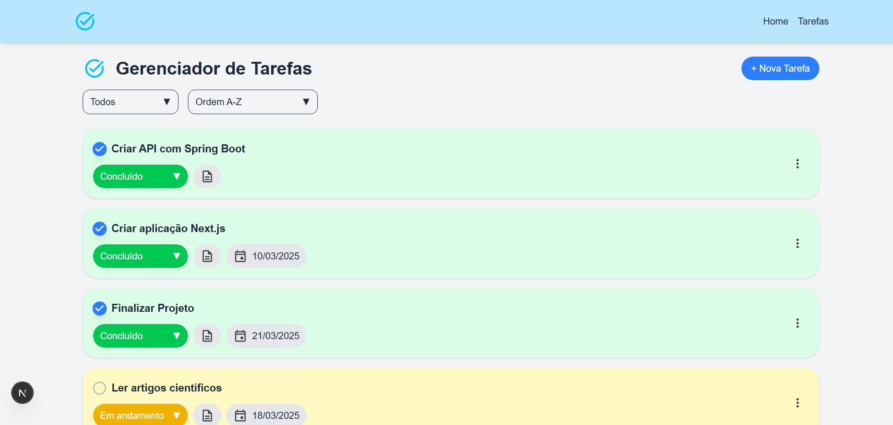
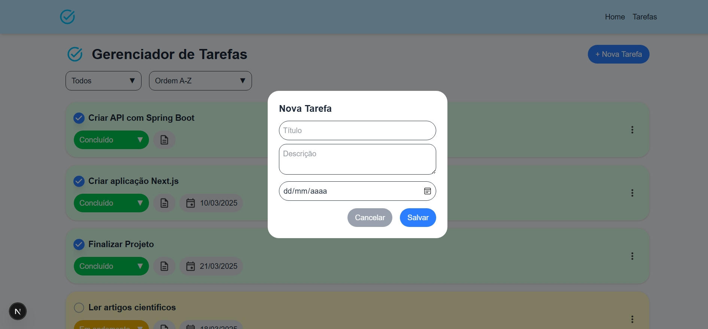

# Sistema de Gerenciamento de Tarefas (Task Manager)


O Task Manager é uma aplicação web voltada para o gerenciamento de tarefas, que permite criar, visualizar, atualizar e excluir tarefas de forma prática e organizada. O projeto utiliza tecnologias modernas no frontend e backend para oferecer uma experiência dinâmica e responsiva.

## 🛠️ Tecnologias Utilizadas

- **Frontend**: 
  - React (v19.0.0) com Next.js (v15.2.2)
  - Tailwind CSS para estilização
  - Zustand e SWR para gerenciamento de estado
  - Axios para requisições HTTP

- **Backend**:
  - Spring Boot com Spring Data JPA
  - Banco de dados PostgreSQL
  - Swagger para documentação da API

- **Outras Tecnologias**:
  - Lombok para reduzir código boilerplate no backend
  - ESLint para padronização do código
  - TypeScript no frontend para tipagem

---

## 📋 Funcionalidades Principais

- Adicionar novas tarefas com título, descrição, status e datas.
- Categorizar tarefas por status: Pendentes, Em andamento e Concluídas.
- Ordenar tarefas por título ou status.
- Atualizar status ou informações das tarefas.
- Excluir tarefas do sistema.
- Backend configurado com PostgreSQL e APIs RESTful.
- Interface amigável com feedback ao usuário (Toasts).

---

## 📚 Como Começar

Siga os passos abaixo para executar o projeto localmente em sua máquina.

### Requisitos

- **Node.js** (>= 16.0.0)
- **Java SDK** (>= 17)
- Banco de dados **PostgreSQL**
- **npm** ou **yarn** para gerenciamento de pacotes

### 1. Clonar o Repositório

```bash
git clone https://github.com/seu-usuario/task-manager-2.git
cd task-manager-2
```

### 2. Configuração do Backend

1. Certifique-se de ter um banco de dados PostgreSQL rodando.
2. Configure as variáveis de ambiente no arquivo `application.properties`:
   ```properties
   spring.datasource.url=jdbc:postgresql://localhost:5432/sua_base_de_dados
   spring.datasource.username=seu_usuario
   spring.datasource.password=sua_senha
   ```
3. Execute o backend:
   ```bash
   ./mvnw spring-boot:run
   ```
4. O backend estará disponível em `http://localhost:8080`.

### 3. Configuração do Frontend

1. Instale as dependências:
   ```bash
   npm install
   ```
2. Execute o servidor de desenvolvimento do Next.js:
   ```bash
   npm run dev
   ```
3. O frontend estará disponível em `http://localhost:3000`.

---

## 🧪 Testando a Aplicação

1. Acesse `http://localhost:3000` no navegador.
2. Adicione, edite, filtre e exclua tarefas pela interface de usuário.
3. Acesse `http://localhost:8080/swagger-ui.html` para ver a documentação e testar as APIs geradas pelo Swagger.

---

## 📂 Estrutura do Projeto

```plaintext
.
├── backend/
│   ├── src/main/java/com/example/taskmanager2
│   │   ├── model/           # Modelos da aplicação
│   │   ├── controller/      # Controllers da aplicação
│   │   ├── service/         # Lógica de negócio
│   │   └── repository/      # Repositórios JPA
│   └── application.properties # Configurações do backend
├── frontend/
│   ├── pages/               # Páginas do Next.js
│   ├── components/          # Componentes reutilizáveis
│   ├── services/            # Serviços de integração com backend
│   ├── store/               # Gerenciamento de estado com Zustand
│   └── styles/              # Estilos utilizando Tailwind CSS
└── README.md                # Documentação do projeto
```

---

## 🛡️ Documentação da API

Acesse o Swagger para explorar as APIs disponíveis:

- URL: `http://localhost:8080/swagger-ui.html`

Principais Endpoints:

- `GET /tarefas`: Lista todas as tarefas com paginação.
- `POST /tarefas`: Cria uma nova tarefa.
- `PUT /tarefas/{id}`: Atualiza dados ou status de uma tarefa pelo ID.
- `DELETE /tarefas/{id}`: Exclui uma tarefa pelo ID.

---

## 🤝 Contribuindo

Sinta-se à vontade para contribuir com melhorias, correções de bugs ou novas funcionalidades. Para isso:

1. Faça um fork do repositório.
2. Crie uma branch com sua nova funcionalidade (`git checkout -b minha-nova-feature`).
3. Commit suas alterações (`git commit -m 'Adicionando nova funcionalidade'`).
4. Envie um pull request.

---

## 📝 Licença

Este projeto está sob a licença **MIT**.

---

## 🚀 Imagem Prévia







---
